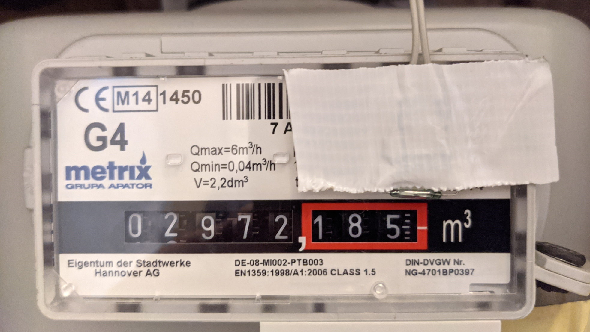

**A gas meter sensor for MySensors home automation networks**

----
This sensor node is attached to the gas meter in my home. It reports gas consumption data via a MySensors gateway to my home automation controller. The gas meter is of the type that creates magnetic pulses when the meter dial moves, so the connection is contactless, and works without access to the inside of the "official" meter from the utility company.

This is part of my home automation setup. For details, see my [blog](https://requireiot.com/my-home-automation-story-part-1/).

- [Features](#features)
- [Hardware](#hardware)
- [Installation](#installation)
- [Initialization](#initialization)
  - [Set base count via MQTT command line](#set-base-count-via-mqtt-command-line)
- [openHAB integration](#openhab-integration)
  - [Items](#items)
  - [Set base count via openHAB REST interface and rule](#set-base-count-via-openhab-rest-interface-and-rule)
  - [Rules](#rules)
- [Implementation notes](#implementation-notes)
  - [Watch crystal instead of `sleep()` function](#watch-crystal-instead-of-sleep-function)
  - [Delayed climate sensor readout](#delayed-climate-sensor-readout)
  - [More power saving](#more-power-saving)
  - [Accuracy](#accuracy)
- [Dependencies](#dependencies)
- [Acknowledgements](#acknowledgements)


## Features

Initially, *MyGasMeter* only reports **incremental** data:
- frequently, it reports the incremental pulse count since the last report, (message 81/1/0/**25**`)
- once per hour, it reports flow [liters/hour] calculated from pulse count (message 81/1/0/**34**`).

Once it has received a **base count** value from the controller, it also starts reporting **absolute** data:
- frequently, it reports the absolute pulse count, i.e. base value + pulses since power on (message 81/1/0/**24**`),
- once per hour, it reports total gas volume [liters] consumed, i.e. (base value + pulses since power on) * liters/pulse (message 81/1/0/**35**`).

With this two-stage approach, the node will always report correct absolute pulse count, even if the gateway misses a message here and there. Also, you can replace the battery on the node and then re-initialize it for the correct absolute pulse count, without relying on EEPROM memory.

The liters/pulse conversion is a constant in the source code which you may have to change, depending on your physical gas meter.

Optionally, the node can also read a brightness sensor and a climate sensor (temperature, atmospheric pressure, humidity) and report those at regular intervals. I found this useful because our gas meter is located inside the bathroom.

## Hardware

The **gas meter** in our home is a G4 Metrix 6G4L. It has a display of 8 digits, 8 mechanical wheels, showing cumulative gas consumption in liters. For every rotation of the least significant wheel it generates one magnetic pulse, i.e. one pulse for every 0.01m³ of gas consumed. I guess there is a small permanent magnet attached to that wheel. 



The magnetic pulse is sensed with a **reed switch** attached to an ATmega328 based MySensors node. I use a KSK 1A87 from [Reichelt](https://www.reichelt.de/reed-kontakt-1-schliesser-i-0-1a-2-0mm-ksk-1a87-p6281.html). This [picture](https://www.energiesparhaus.at/bilderupload2012/20121113951426.jpg) indicates the correct placement of the reed switch.

The **MySensors node** is built from a [My Slim 2AA Battery Node](https://forum.mysensors.org/topic/2067/my-slim-2aa-battery-node), with a 32,768 Hz watch crystal attached to XTAL1 and XTAL2 (see hardware folder for schematic).

For the version with the climate sensor, I used a 100x60mm plastic project box from Aliexpress.
 

The version without climate sensor fits in a piece of plastic cable duct


The node is powered by 2 AA **batteries**; the last set of batteries lasted for about 20 months without and 12 months with brightness and climate sensors.

The I/O connections are very simple: 
- the reed switch is attached to PD3 and PD4, 
- an optional photo transistor is attached between PC2 and GND, and via a 100 kΩ resistor to PC3, so it can be powered only when needed.
- an optional BME280 climate sensor is connected to the I2C interface on PC4, PC5
- an LED can be temporarily attached between PC0 and GND via a 1 kΩ current limiting resistor. This helps with finding the correct spot for the reed switch, see below.
- for debugging purposes, PC1 goes HIGH whenever the controller is not sleeping.

## Installation

Before installing the sensor, I attached an LED and 1 kΩ resistor to pin PC0 of the microcontroller. The software mirrors the state of the reed switch on the LED. Then I cranked up the heat, so the gas meter dial was turning, and I positioned the reed switch over the least significant digit of the meter until the LED flashed once per revolution of the dial. After fixing the reed switch with tape, I removed the LED.

## Initialization

After power up (e.g. after you put in a fresh set of batteries), the node will 
1. present its sensor items as expected by the MySensors framework.
2. request from the gateway a base value for absolute pulse count (sensor 81, type `V_VAR1`),
3. report an absolute pulse count (sensor 81, type `V_VAR1`) of zero

The node will not sleep until a base value for absolute pulse count has been received, so don't wait too long to provide this value, to conserve battery. It will continue to request a base count value at regular intervals until it receives an answer.

The following description assumes (adjust for your setup)
- The sensor is node #126
- There is a MySensors MQTT gateway that publishes messages from the sensor as topic `my/+/stat/126/#`, and forwardfs messages with topic `my/cmnd/126/#` to the sensor
- [mosquitto](https://mosquitto.org/) is used as the MQTT broker, 

### Set base count via MQTT command line

To set the **base count** value via MQTT, follow these steps. A more elegant, automated way to do this with openHAB is described below.

- in one shell listen to messages from that node
```
mosquitto_sub -t 'my/+/stat/126/#'
```
- wait for the sensor to send its initial report, e.g.
```
my/2/stat/126/81/1/0/24 0
my/2/stat/126/81/2/0/24
```
- then, in another shell, set the initial value (gas meter showed 6591.970 m³)
```
mosquitto_pub -t "my/cmnd/126/81/1/0/24" -m '659197'
```

## openHAB integration

I use openHAB for home automation, currently version 2.4, but other environments should work, too.

### Items

openHAB items are defined for each sensor type reported by the node
```
// items reported by sensor node

// relative pulse count reported by node, since last report
Number GasMeter_L_RelCount "Gas Rel Count L [+%d]" <gas>          
    {mqtt="<[mosquitto:my/+/stat/126/81/1/0/25:state:default]"}
// absolute pulse count reported by node, or 0 if base value has not been received yet
Number GasMeter_L_Count "Gas Count L [%d]"         <gas>          
    {mqtt="<[mosquitto:my/+/stat/126/81/1/0/24:state:default]"}
// liters per hour as reported by node
Number GasMeter_L_Flow "Gas Flow L [%d l/h]"       <gas>          
    {mqtt="<[mosquitto:my/+/stat/126/81/1/0/34:state:default]"}
// total gas volume in liters displayed by gas meter
Number GasMeter_L_Volume "Gas Vol L [%d l]"        <gas>          
    {mqtt="<[mosquitto:my/+/stat/126/81/1/0/35:state:default]"}

// unbound items

// absolute pulse count, persistent, sent back to node on request
Number GasMeter_L_AbsCount "Gas Abs Count L [%d]"  <gas>

// items related to request/set base count

String GasMeter_L_VAR1_Request                     <gas>          
    {mqtt="<[mosquitto:my/+/stat/126/81/2/0/24:state:default]"}
Number GasMeter_L_VAR1_Response                    <gas>          
    {mqtt=">[mosquitto:my/cmnd/126/81/1/0/24:command:*:default]"}
```
If the code is compiled with support for the optional brightness and climate sensors, then those are converted to OpenHAB items as well
```
Number BRL_Lux          "Brightness [%.0f%%]"      <slider>       
    {mqtt="<[mosquitto:my/+/stat/126/61/1/0/23:state:default]"}
Number BRL_Temp         "Temperature [%.1f°]"      <temperature>  
    {mqtt="<[mosquitto:my/+/stat/126/41/1/0/0:state:default]"}
Number BRL_Hum          "Humidity [%.0f%%]"        <humidity>     
    {mqtt="<[mosquitto:my/+/stat/126/51/1/0/1:state:default]"}
```

Like all my sensor nodes, it reports its own battery voltage, in absolute millivolts and as a percentage of usable battery voltage range
```
Number GasMeter_L_VCC   "Gas L VCC [%.0f mV]"      <gas>          
    {mqtt="<[mosquitto:my/+/stat/126/99/1/0/38:state:default]"}
Number GasMeter_L_Bat   "Gas L Bat [%.0f %%]"      <battery>      
    {mqtt="<[mosquitto:my/+/stat/126/255/3/0/0:state:default]"}
```

### Set base count via openHAB REST interface and rule

Before you power up the node for the first time, go read the current gas volume displayed by the gas meter, and set the corresponding openHAB item e.g. via the REST interface.

Say the meter shows 6591,970 m³, and your openHAB item is named `GasMeter_AbsCount`. Enter on the command line
```
curl -X PUT --header "Content-Type: text/plain" --header "Accept: application/json" -d "659197" "http://servername:8080/rest/items/GasMeter_AbsCount/state"
```
or use the interactive REST interface at http://*servername*:8080/doc/index.html.

### Rules

Two simple openHAB rules are defined for the gas meter.

Rule 1: if node reports an absolute pulse count > 0, then trust it and write it to the unbound item used within openHAB.
```
rule "update gas meter click"
when
    Item GasMeter_L_Count changed
then
    var newCount = GasMeter_L_Count.state as Number
    if (newCount == NULL) newCount = 0
    if (newCount > 0) {
        GasMeter_L_AbsCount.sendCommand(newCount)
    }
end 
```
Rule 2: when the node requests an absolute base value, reply with the absolute pulse count used by openHAB
```
rule "send init val to gas meter"
when
    Item GasMeter_L_VAR1_Request received update
then 
    GasMeter_L_VAR1_Response.sendCommand(GasMeter_L_AbsCount.state as Number)
end 
```

## Implementation notes

If you just want to use this gas meter node in your home, then ignore the rest of this section. If you want to learn from this for your own projects, then read on ...

### Watch crystal instead of `sleep()` function

The node must be battery-powered (read: low supply current, sleep as much as possible), but it can't use the MySensors `sleep()` function, because we need a fairly accurate timebase so we can report flow in liters per hour.

We use the (not so accurate) internal RC oscillator of the AVR to clock the CPU, but a (much more accurate) external 32768 Hz crystal to clock Timer2, which generates interrupts every 10ms, so we can debounce the reed switch, and do all other housekeeping as needed. 

In between interrupts, we sleep in `SLEEP_MODE_PWR_SAVE` mode, which stops most of the processor's peripherals, except for Timer2. During sleep, Timer0 as used by the Arduino framework is stopped, so we can't rely on the Arduino `millis()` function for timing. Instead, we use a milliseconds counter incremented by the Timer2 ISR for timing purposes (has an hour passed? should we report pulse count or flow or climate?).

### Delayed climate sensor readout

According to the BME280 datasheet, one measurement of temperature, humidity and pressure takes >11ms. The normal measurement function from the Arduino library will request a measurement, wait until it is completed, and then read out and return the measurement results. 

A more power-efficient way to do this is to request a measurement just before sending the processor to sleep, and then read out the measurement results 1s later, the next time the `loop()` function is run.

### More power saving

The pin sensing reed switch closure is programmed as a input with the internal pull-up resistor enabled.
The goal here is to avoid a situation where current would flow through the pull-up resistor as long as the magnetic pulse is active -- which could be a long time if the meter happens to stop in the position of the display dial where the magnetic signal is active.

To avoid that, the other end of the reed switch is not connected to GND, but to another AVR pin programmed as an output. Most of the time, that other AVR pin is set to HIGH. When the switch needs to polled, the pin is briefly set to LOW, and the signal is read. 

With this setup, the average power consumption is about 50µA at 3.3V with an 8 MHz processor clock and a ~100 Hz interrupt rate.

### Accuracy

The very attentive reader will now ask: how can you achieve an interrupt rate of *exactly* 100 Hz with a 32768 Hz timer clock frequency, using the AVR timer capabilities? Answer: you can't, the interrupt rate is 99 Hz, so the reported flow in liters/hour is off by 1%, and the specified timing of "report once per hour" or "report once per 5 minutes" is also off by 1% ... acceptable for my use cases. Note that the reported absolute pulse counts are always correct, so if you calculate m³/day from those, it will be correct.

## Dependencies

The code for this node depends on
- MySensors, obviously, tested with version 2.3.2
- my [stdpins](https://github.com/requireiot/stdpins) library for digital I/O with AVR controllers, much faster and more flexible than normal Arduino I/O 
- my [AvrTimers](https://github.com/requireiot/AvrTimers) library for configuring the ATmega timer/counter units, which includes support for running Timer2 with an external watch crystal
- my [debugstream](https://github.com/requireiot/debugstream) and [DebugSerial](https://github.com/requireiot/DebugSerial) libraries for printf-style debug output to the UART interface, which is only active if an FTDI serial-to-USB module is connected.

## Acknowledgements

The reed switch solution was inspired by this blog post: https://www.energiesparhaus.at/forum-gaszaehler-metrix-6g4l-reed-kontakt/29038 (in German).
